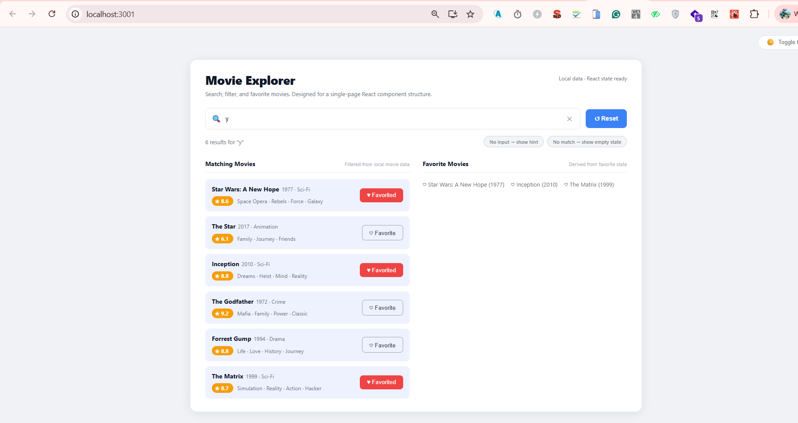

# Movie Database Interface

A single-page React application for Part B of the ReactJS assignment. It demonstrates search state, dynamic filtering, conditional rendering, and favourite management — all within a clean, responsive UI.




---

## Features

### B1 — Search Input with State
- Controlled `<input>` bound to a `query` state variable via `useState`.
- Results update on every keystroke (no submit needed).
- An **✕** button clears only the search text; the **↺ Reset** button clears both the search and all saved favourites.

### B2 — Movie Filtering Logic
- 10 local movies stored as a constant array (no API calls).
- Filtered with `useMemo` — searches across **title**, **genre**, and **tags** (case-insensitive substring match).
- Example: typing `"star"` returns *Interstellar* (tag `Stars`), *Star Wars: A New Hope*, and *The Star*.

### B3 — Conditional Rendering
| State | What is rendered |
|---|---|
| No input (empty query) | `"Start typing to search for movies..."` |
| Query with matches | Movie cards for every match |
| Query with no matches | `"No movies found for '…'."` |

Two indicator pills in the status bar (**No input → show hint** / **No match → show empty state**) document the three states at a glance.

### B4 — Favourite Toggle
- Each movie card has a **♡ Favorite** / **♥ Favorited** button.
- Favourite IDs are stored in a `Set` via `useState`.
- Toggling is O(1): `Set.add` / `Set.delete` on a new `Set` copy to maintain immutability.
- Favourited cards display a red filled button; un-favourited cards show an outline button.

### B5 — Display Favourite Movies
- A `useMemo`-derived list filters `MOVIES` to only favourited IDs.
- Displayed in the **Favorite Movies** column as inline items: `♡ Title (Year)`.
- When no favourites exist: `"You haven't added any favorites yet."`

---

## Running the App

```bash
npm install
npm start
```

Open [http://localhost:3000](http://localhost:3000) in your browser.

---

## Tech Stack

| Tool | Purpose |
|---|---|
| React 18 | UI library |
| `useState` | Search query, favourite set, dark-mode toggle |
| `useMemo` | Derived filtered & favourite lists |
| CSS custom properties | Light / dark theme switching |
| Create React App | Build tooling |

---

## Project Structure

```
src/
├── App.js                      # Root — renders MovieExplorer
└── components/
    ├── MovieExplorer.js        # Part B main component
    ├── MovieExplorer.css       # Styles (light + dark theme)
    ├── BollywoodMovie.js       # Part A component (preserved)
    └── BollywoodMovie.css      # Part A styles (preserved)
```

---

## UI Overview

```
┌─────────────────────────────────────────────────────── ☀️ Toggle theme ┐
│ Movie Explorer                          Local data · React state ready  │
│ Search, filter, and favorite movies...                                  │
│                                                                         │
│ [🔍 Search movies (e.g. "Interstellar", "Star")          ✕] [↺ Reset] │
│ 3 results for "star"          [No input → show hint] [No match → ...]  │
│                                                                         │
│  Matching Movies        Filtered │  Favorite Movies      Derived from   │
│ ┌──────────────────────────────┐ │  ♡ Interstellar (2014)              │
│ │ Interstellar  2014 · Sci-Fi  │ │  ♡ The Star (2017)                  │
│ │ ★8.6  Adventure · Space ...  │ │                                     │
│ │                  [♥ Favorited]│ │  You haven't added any favorites... │
│ └──────────────────────────────┘ │                                     │
│ ┌──────────────────────────────┐ │                                     │
│ │ Star Wars: A New Hope  1977  │ │                                     │
│ │ ★8.6  Space Opera · Rebels   │ │                                     │
│ │                    [♡ Favorite]│                                     │
│ └──────────────────────────────┘ │                                     │
└─────────────────────────────────────────────────────────────────────────┘
```
